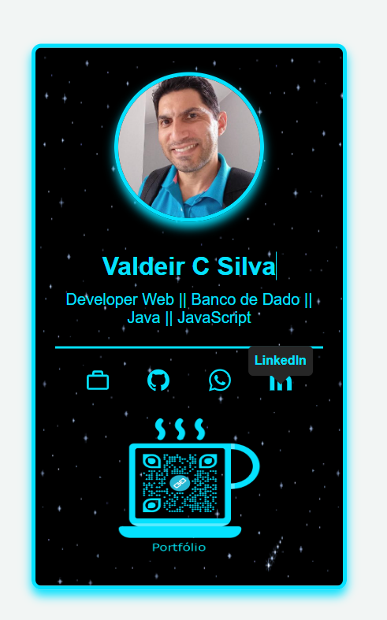

# Meu Cartão de Visita

Meu Cartão de Visita é uma apresentação pessoal que destaca minhas habilidades e informações de contato como desenvolvedor web. Este projeto foi criado utilizando HTML e CSS, com um design moderno e responsivo.

## Link do Cartão de Visita

Acesse meu cartão de visita online aqui: [Meu Cartão de Visita](https://valdeircesario.github.io/Busines-card/)

## Visão Geral

O Meu Cartão de Visita apresenta um resumo das minhas habilidades e contatos, incluindo links para minhas redes sociais e informações sobre minha experiência profissional.

## Demonstração

Veja abaixo algumas capturas de tela do MeuPortfolio:

<div style="display: flex; flex-direction: column; align-items: center; justify-content: center;">
    <div style="margin-bottom: 20px;">
        
        <p><em>Figura 1:Busnes Card.</em></p>
    </div>
    <div style="margin-bottom: 20px;">
        
        <p><em>Figura 2:Business card.</em></p>
    </div>
    
</div>


## Tecnologias Utilizadas

O projeto foi desenvolvido com as seguintes tecnologias:
<div style="display: inline_block"><br>
        
  
  
  
    
 

  
</div>
<P></P>

- **HTML**: Estrutura do site.
- **CSS**: Estilização visual.
- **VSCode**: Editor de código usado durante o desenvolvimento.

## Como Executar o Projeto

Para rodar o MeuPortfolio localmente, siga os passos abaixo:

1. Clone o repositório:
   ```bash
   https://github.com/valdeircesario/Business-card.git
